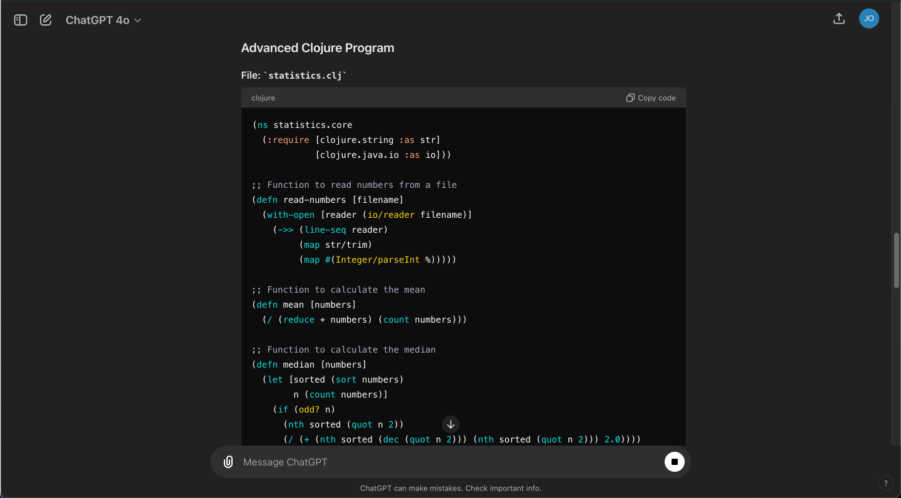

# A Clojure syntax highlighter for ChatGPT

ChatGPT currently doesn't highlight Clojure Syntax so I created this Chrome extension that does that. This extension automatically applies syntax highlighting to Clojure code blocks, making it easier to read and understand code snippets.

## Disclaimer

This extension is not affiliated with, endorsed by, or associated with ChatGPT, OpenAI, or any of their products or services.

## Features

- Automatically highlights Clojure code blocks in ChatGPT outputs.
- Utilizes Prism.js for syntax highlighting.
- Clean and modern design with a dark theme for better readability.

## Screenshots

Here are some screenshots of the extension in action:

### ChatGPT without the extension


### ChatGPT with Clojure Syntax Highlighting



## Installation

1. **Clone the Repository**
    ```sh
    git clone https://github.com/yourusername/chatgpt-clojure-syntax-highlighter.git
    cd chatgpt-clojure-syntax-highlighter
    ```

2. **Load the Extension in Chrome**
    - Go to `chrome://extensions/` in your Chrome browser.
    - Enable "Developer mode" by toggling the switch in the upper-right corner.
    - Click on the "Load unpacked" button and select the directory where you cloned the repository.

## Usage

- Once the extension is loaded, navigate to ChatGPT and start using it as usual.
- Clojure code blocks will be automatically highlighted.

## Development

### Prerequisites

- Ensure you have the latest version of [Node.js](https://nodejs.org/) installed.

### Build

- To build and package the extension, simply zip the project directory:
    ```sh
    zip -r chatgpt-clojure-syntax-highlighter.zip .
    ```

### Files and Directories

- `manifest.json`: The manifest file for the Chrome extension.
- `content.js`: The content script that handles syntax highlighting.
- `styles.css`: Custom styles for the extension.
- `prism/`: Contains Prism.js library files.
- `icons/`: Contains icon files for the extension.

## Contributing

Contributions are welcome! Please fork the repository and create a pull request with your changes.

1. Fork the repository.
2. Create a new branch: `git checkout -b my-branch-name`.
3. Make your changes and commit them: `git commit -m 'Add some feature'`.
4. Push to the branch: `git push origin my-branch-name`.
5. Submit a pull request.

## License

This project is licensed under the MIT License. See the [LICENSE](LICENSE) file for details.

## Contact

If you have any questions or suggestions just open an issue here.
